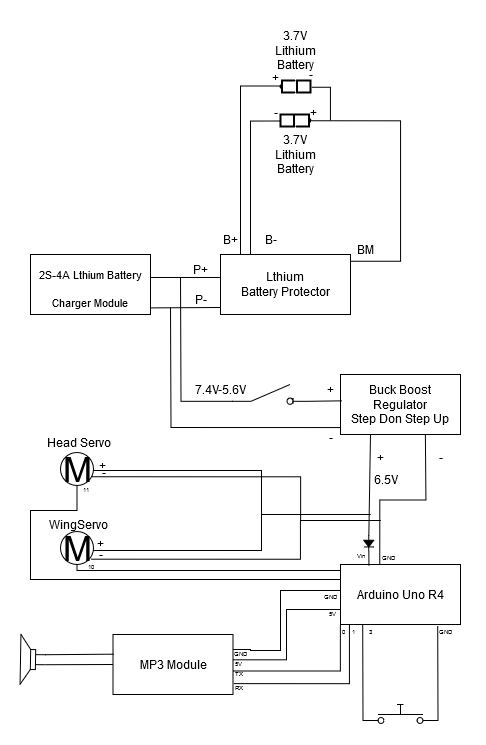

# Valor Animatronic

## Animation instructions
### Head servo
Position  | Angle |
----|----|
 Left   | 180  |
 Middle | 90 |
 Right | 0 |

### Wing servo
Position  | Angle |
----|----|
 Up  | 120 |
 Down| 180 |

## Assembly  
### Wiring Diagram

### Pin usage
Pin  | Type  | Purpose   |
----|----|---|
 0  | Serial | MP3 module  TX |
 1  | Serial | MP3 module  RX |
 3  | INPUT  | Button         |
 10 | PWM | Wing Servo        |
 11 | PWM | Head Servo        |

### STL Files

### Assembly instructions